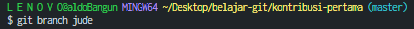

# BELAJAR KONTRIBUSI KE GITHUB

> Repository untuk belajar kontribusi ke github. Repository ini terispirasi dari salah satu repository yang digunakan untuk belajar juga yaitu [first-contribution](https://github.com/firstcontributions/first-contributions) dan saya kemas lagi dengan tujuan untuk mempermudah proses belajar kontribusi ke open source baik untuk saya pribadi ataupun untuk umum.

## Cara Kontribusi

1. Lakukan `fork` pada repository ini

   


2. `create fork` ke repository mu

   


3. Copy url repository yang sudah di `fork` untuk proses clone. Pastikan sudah di repo mu seperti di kotak biru <nama-kamu>/kontribusi-pertama

   


4. Lakukan `clone` pada repo yang sudah di fork menggunakan terminal atau dapat langsung menggunakan VSCode.

```
git clone https://github.com/<username-kamu>/kontribusi-pertama.git
```

   


5. Masuk ke directory repository yang baru saja di clone menggunakan perintah

```
cd kontribusi-pertama
```

   


6. Buat branch baru untuk menambahkan data mu

   ```
   git branch <nama-mu>
   ```

   


7. Pindah ke branch yang baru dibuat

   ```
   git switch <nama-mu>
   ```

   


8. Buka `index.js`

   


9. Tambahkan data mu kedalam variabel `people` dan jangan lupa untuk di `save` setelah menambahkan data mu

   


10. Tambahkan perubahan menggunakan 

   ```
   git add index.js
   ```

   


11. Lakukan `commit` pada perubahan yang baru saja dibuat

   ```
   git commit -m "<pesan-mu>"
   ```

   


12. Push perubahan yang baru saja dibuat ke branch yang sudah dibuat di step 6.

   ```
   git push origin <branch-mu>
   ```

   


13. Kembali ke `github` untuk melakukan proses `Pull Request`

   


14. Langkah terakhir adalah submit `Pull Request` mu dengan menekan tombol `Create pull request`

   


15. Selesai.


### Catatan

Setelah melakukan proses `pull request`, perubahan yang sudah ditambahkan kamu akan direview dan akan ditambahkan oleh pemilik asli repository. Setelah di review dan ditambakan oleh pemilik asli repository maka perubahan sudah dapat dilihat di repository aslinya. 


### Ucapan Selamat

Selamat kamu sudah berhasil untuk melakukan kontribusi ke github. Terima kasih sudah mau berkontribusi untuk repository ini. Semoga bermanfaat.

---

<font size="2"> ❤️ [Aldo Bangun](https://github.com/aldobangun) </font>